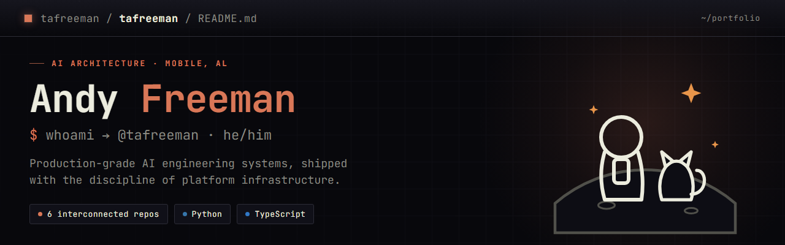
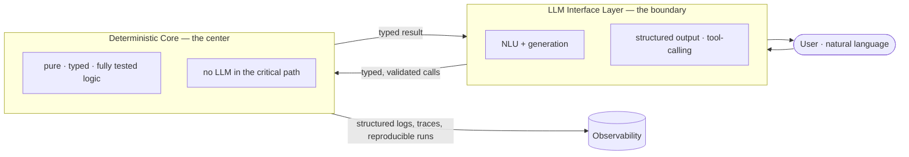

<!--  Profile README for tafreeman/tafreeman.
  CONSTRAINTS (GitHub-Flavored Markdown): no <style>, external CSS, JSX, or JS
  executes here, and custom fonts (JetBrains Mono) do NOT render. The design
  system is therefore applied through (1) shields.io badge colors (?color=d97757,
  the ember accent), (2) committed on-brand SVG/PNG header art, and (3) layout via
  tables / <div align> / <picture>. React components from the live site cannot be
  embedded — the live, fully-styled experience is at https://tafreeman.github.io/tafreeman/.
  REAL DATA ONLY: no hardcoded star/fork/commit counts; live numbers come from
  dynamic badges or are omitted.
-->

<div align="center">

<!--[](https://tafreeman.github.io/tafreeman/)-->

# Andy Freeman · `@tafreeman`

[](https://github.com/tafreeman/tafreeman/actions/workflows/validate.yml)
[](https://www.linkedin.com/in/andy-freeman-architect/)
[](https://github.com/tafreeman)

</div>

---

Five repositories (four public, one forthcoming): reusable LLM execution primitives, multi-agent orchestration, a deterministic business app with an AI interface, a presentation/tooling platform, and a testing-enablement curriculum. The three LLM-facing systems (ExecutionKit, Agentic Runtime Platform, Financial Scenario Engine) pair a deterministic, fully-tested core with an LLM interface layer rather than putting the model in the critical path; the Architecture Deck System and QA Automation Academy are evaluated on their own terms — a rendering/export platform and a training curriculum — rather than against that same pattern.

**Start here:** [ExecutionKit](https://tafreeman.github.io/executionkit/) (the primitive layer) → [Agentic Runtime Platform](https://tafreeman.github.io/agentic-runtime-platform/) (the platform that consumes it) → [Financial Scenario Engine](https://tafreeman.github.io/financial-scenario-engine/) (an applied example).

AI-assisted development appears across the portfolio where it accelerates implementation; architecture, tests, and public releases remain under my review.


## How they compose

Primitives flow upward into platforms; platforms emit telemetry into research and communication surfaces:

- **L1 · Primitives** — `ExecutionKit` (consensus · ReAct · budget-aware calls)
- **L2 · Platform** — `Agentic Runtime Platform` (DAG · routing · failover · observability)
- **L3 · Communication + Applied** — `Architecture Deck System`, `Financial Scenario Engine`, `QA Automation Academy`

The interactive, fully-styled version of this graph lives on the portfolio site → **[tafreeman.github.io/tafreeman](https://tafreeman.github.io/tafreeman/)**


## The architecture, in one diagram

The three LLM-facing systems — ExecutionKit, Agentic Runtime Platform, and Financial Scenario Engine — follow the same pattern: a deterministic, fully-tested core insulated from the non-determinism of LLMs, which sit at the interface boundary rather than in the critical path. The Architecture Deck System (a React/Vite presentation and export platform) and QA Automation Academy (a Playwright + Copilot testing curriculum) don't put an LLM in their runtime path at all, so this diagram doesn't describe them:



<sub>The Observability edge is real, not aspirational: workflow and agent spans are emitted through [OpenTelemetry](https://github.com/tafreeman/agentic-runtime-platform/blob/main/agentic-workflows-v2/agentic_v2/integrations/otel.py) and exported via an [OTLP collector to Jaeger](https://github.com/tafreeman/agentic-runtime-platform/blob/main/otel/otel-collector-config.yaml), with structured logs and reproducible run artifacts alongside.</sub>


## The systems

Most repositories have their own styled GitHub Pages site, and the QA Automation Academy is currently private ahead of its public release. These are the canonical repos; private `*-archive` copies are legacy snapshots kept outside the portfolio surface.

| System | What it is | Stack | Live |
|---|---|---|---|
| **[Agentic Runtime Platform](https://tafreeman.github.io/agentic-runtime-platform/)** · `PLATFORM` | Multi-agent orchestration — declarative YAML workflows compiled to executable DAGs, tiered model routing across 8 model backends (plus any OpenAI-compatible endpoint), failover, [evaluation](https://github.com/tafreeman/agentic-runtime-platform/blob/main/docs/architecture-eval.md), and [live observability](https://github.com/tafreeman/agentic-runtime-platform/blob/main/otel/otel-collector-config.yaml). | Python | [docs ↗](https://tafreeman.github.io/agentic-runtime-platform/) · [repo ↗](https://github.com/tafreeman/agentic-runtime-platform) |
| **[ExecutionKit](https://tafreeman.github.io/executionkit/)** · `LIBRARY` | Provider-agnostic LLM execution primitives — consensus, refinement, ReAct tool loops, structured output, budget-aware calls. Zero runtime dependencies. | Python | [docs ↗](https://tafreeman.github.io/executionkit/) · [repo ↗](https://github.com/tafreeman/executionkit) |
| **[Financial Scenario Engine](https://tafreeman.github.io/financial-scenario-engine/)** · `APPLIED AI` | Local-first project finance — a deterministic TypeScript engine produces every number; the LLM only parses intent and narrates. SQLite-backed, GitHub Models or local Ollama. | TypeScript | [site ↗](https://tafreeman.github.io/financial-scenario-engine/) · [repo ↗](https://github.com/tafreeman/financial-scenario-engine) |


<sub>Live repo signal (updates automatically — no hardcoded counts):</sub>

[](https://github.com/tafreeman/agentic-runtime-platform)
[](https://github.com/tafreeman/executionkit)
[](https://github.com/tafreeman/financial-scenario-engine)

---

## Develop / run locally

Reproduce the CI validation gate (JSX-syntax check + HTML validation) in under two minutes:

```sh
npm ci
npm run validate
```

Serve the site locally and open the canonical portfolio entry:

```sh
python -m http.server 8099
# then open → http://localhost:8099/index.html
```

`index.html` is the canonical GitHub Pages entry (served at `https://tafreeman.github.io/tafreeman/`).

---

<div align="center">

**AI engineering and AI solutions-architecture.**
**[LinkedIn](https://www.linkedin.com/in/andy-freeman-architect/)**.

</div>
