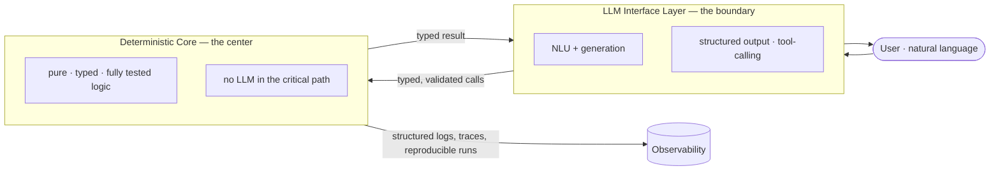

## Andy Freeman — Principal AI and Software Engineering Architect

[LinkedIn Profile](https://www.linkedin.com/in/andy-freeman-architect/) · tandfreeman@gmail.com

A portfolio of production-oriented AI engineering systems: reusable LLM execution primitives, multi-agent orchestration platforms, and deterministic business applications with AI interfaces. Built on a foundation of enterprise and federal systems delivery, now focused on AI-native architecture and production engineering — designing systems that pair deterministic, auditable cores with LLM-driven interfaces.

**Start with [Agentic Runtime Platform](https://github.com/tafreeman/agentic-runtime-platform)** (the flagship), then [ExecutionKit](https://github.com/tafreeman/executionkit) for the primitive layer and [Financial Scenario Engine](https://github.com/tafreeman/financial-scenario-engine) for an applied example.

## The Architecture, in One Diagram

Every project below follows the same pattern — a deterministic, fully-tested core insulated from the non-determinism of LLMs, which sit at the interface boundary rather than in the critical path:

## Portfolio Map

| Project | Focus | Description |
|---|---|---|
| [Agentic Runtime Platform](https://github.com/tafreeman/agentic-runtime-platform) | Agentic AI Platform | Multi-agent workflow runtime with DAG execution, model routing, provider failover, evaluation, and observability. Typed Python core behind an enforced coverage gate. |
| [ExecutionKit](https://github.com/tafreeman/executionkit) | AI Engineering Library | Provider-agnostic Python primitives for consensus, refinement, ReAct loops, structured output, and budget-aware LLM calls. ruff + mypy with a coverage gate that fails the build. |
| [Financial Scenario Engine](https://github.com/tafreeman/financial-scenario-engine) | Applied Business AI | Local-first project financial analysis engine with deterministic calculations and optional LLM-assisted scenario parsing. Zero TODOs; determinism enforced in CI. |
| [Agentic Systems Lab](https://github.com/tafreeman/agentic-systems-lab) | R&D / Prototyping | Research lab for agentic workflows, security hardening, orchestration experiments, and evaluation patterns. Same ruff + mypy + build-failing coverage discipline. |

## Beyond the Featured Four

These four public repositories are my production-oriented showcase. The portfolio also includes additional work kept in **private repositories** — notably an agentic architecture-deck generator (React/TypeScript) and a QA-automation training app built on Playwright — available on request.

---

**Open to Principal / Staff AI engineering and AI solutions-architecture roles.** Reach me at tandfreeman@gmail.com or on [LinkedIn](https://www.linkedin.com/in/andy-freeman-architect/).
